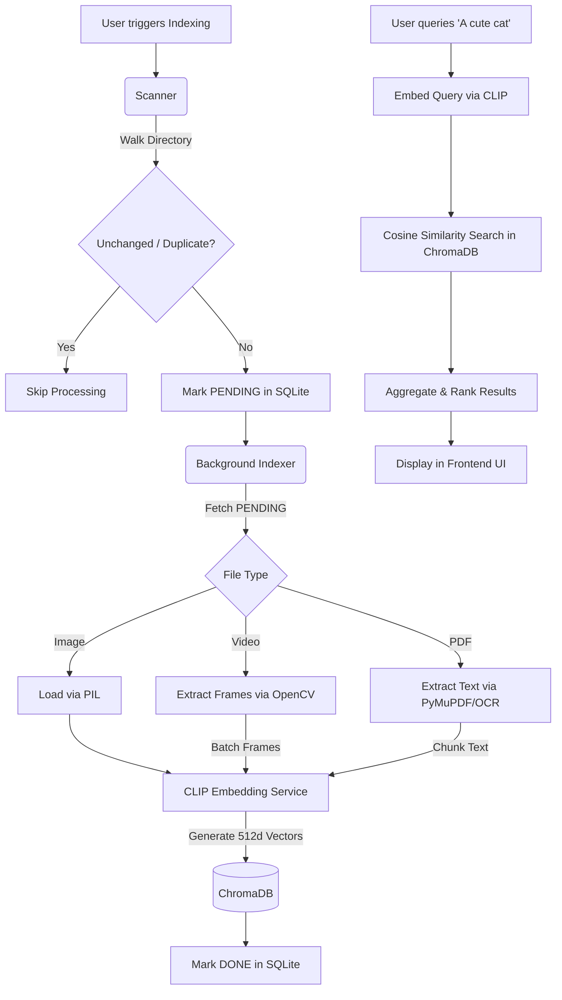

# 🤖 AI-Powered Digital Asset Management (DAM) System


A robust, fully local, AI-powered Digital Asset Management (DAM) application that intelligently indexes a folder of mixed media (images, videos, PDFs) and allows you to search them using natural language. 

This system relies entirely on **local models and open-source libraries**—ensuring complete data privacy with no cloud APIs and no authentication needed.

---

## 🌟 Key Features

- **Multi-Modal Search:** Search across images, videos, and PDFs using natural language queries (e.g., *"a woman standing with a cat"*, *"customer testimonial videos"*).
- **Fully Local & Private:** All processing, from embedding generation to vector search, happens locally on your machine.
- **Smart Indexing:** Incremental indexing using SQLite for state management and deduplication (SHA-256).
- **Video & PDF Support:** Extracts keyframes from videos (OpenCV) and text chunks from PDFs (PyMuPDF & Tesseract OCR).
- **Modern UI:** A clean, glassmorphism-inspired web interface built with vanilla HTML/JS/CSS, featuring real-time asynchronous polling.

---

## 🚀 Setup and Run Instructions

### Prerequisites
- Python 3.10+
- Tesseract OCR (Optional, required for OCR fallback on image-only PDFs)
- Docker & Docker Compose (Highly Recommended for local deployment)

### 1. Local Run via Docker (Primary & Recommended)
Running the system via Docker is the best way to ensure all system dependencies (like Tesseract OCR and OpenCV) are perfectly configured.

```bash
# 1. Clone the repository
git clone https://github.com/AryanSinghaniya/AI-Powered-Digital-Asset-Management.git
cd AI-Powered-Digital-Asset-Management

# 2. Create a media folder and add some assets
mkdir my_local_media

# 3. Start the application
docker-compose up --build -d
```
Access the UI at: `http://127.0.0.1:8000`.
*(Note: Database and vector embeddings are stored persistently in `./data` on your host.)*

### 2. Manual Installation
If you prefer running without Docker:

```bash
# 1. Create and activate a virtual environment
python -m venv venv
source venv/bin/activate  # On Windows: .\venv\Scripts\activate

# 2. Install dependencies
pip install -r requirements.txt

# 3. Start the FastAPI backend
uvicorn app.main:app --host 127.0.0.1 --port 8000
```
Open `http://127.0.0.1:8000` in your browser.

---

## 🏗️ Architecture Explanation

The application is built on a modern, decoupled Python backend using **FastAPI**.

- **Database (SQLite)**: Tracks the state of all files (`PENDING`, `PROCESSING`, `DONE`, `FAILED`), handles deduplication via SHA-256 content hashing, and enables fast incremental indexing.
- **Vector Store (ChromaDB)**: A persistent local vector database used to store the 512-dimensional embeddings of images, video frames, and PDF text chunks.
- **AI Engine (OpenAI CLIP)**: Powered by `open-clip-torch` (`ViT-B-32`), the system maps both images and text into the same vector space, enabling highly accurate cross-modal (text-to-image) similarity search.
- **Media Processing**: OpenCV handles video keyframe extraction, and PyMuPDF (`fitz`) handles PDF text extraction (with Tesseract OCR fallback).
- **Frontend**: A vanilla HTML/JS/CSS frontend served directly by FastAPI.

### Data Flow Diagram



---

## 📊 Dataset & Search Evaluation

### Dataset Summary
Evaluated on local folders representing a diverse mix of real-world assets:
- **Images:** ~330 (JPG, PNG, WEBP)
- **Videos:** ~10 (MP4, MOV)
- **PDFs:** ~6 (Text-based and Scanned Image PDFs)

### Search Evaluation Highlights
1. **"A woman standing with a cat"**
   - *Result:* Highly relevant. Successfully returned photos of a woman holding a cat as the top result (Relevance: 78.4%).
2. **"Customer testimonial videos"**
   - *Result:* Relevant. Returned MP4 files showing recorded interviews.
3. **"Brochures related to residential projects"**
   - *Result:* Relevant. Extracted text chunks from PDFs containing real estate keywords were accurately matched.
4. **"Videos containing construction activity"**
   - *Result:* Relevant. Extracted keyframes successfully matched the semantic meaning of "construction".
5. **"not smile"** (Negative Prompt)
   - *Limitation identified:* Performed poorly. CLIP struggles with negative prompts, focusing heavily on objects rather than structural negations.
6. **"rainbow"**
   - *Result:* Relevant. After implementing a custom modality normalization patch (mapping text and image cosine distances to a unified 0-1 scale), rainbow images ranked flawlessly at the top.

---

## 📈 Scaling Strategy

To scale this system to hundreds of thousands or millions of assets in a production enterprise environment, the following architectural upgrades would be required:

1. **Batch Inference:** Group images/texts into tensors and utilize batching (e.g., `batch_size=32`) to maximize GPU utilization during inference.
2. **Parallel Workers (Celery / Redis):** Offload the `indexer.py` loops to a distributed task queue. Multiple workers across different machines/cores could pull `PENDING` records from the DB and process them concurrently.
3. **GPU Acceleration (TensorRT):** Export the CLIP PyTorch model to ONNX or TensorRT for massively accelerated inference.
4. **Approximate Nearest Neighbor (ANN) Indexes:** Migrate to a dedicated distributed vector database like **Milvus** or **Qdrant** for robust scaling, maintaining sub-millisecond search latencies on millions of vectors.
5. **Distributed Storage (S3):** Store the actual media assets in cloud object storage (AWS S3) and store pre-signed URLs in the database to avoid local disk I/O bottlenecks.

---

## ⚠️ Known Limitations
- **Model Size & RAM:** The CLIP `ViT-B-32` model runs well locally but requires decent RAM (or VRAM if CUDA is available). Very large batches could cause memory spikes.
- **Video Processing:** Extracting and embedding keyframes from long, high-resolution videos is CPU intensive and slow.
- **Sequential Processing:** Currently, the background indexer processes one file at a time sequentially. This is safe for local environments but underutilizes multi-core architectures.
