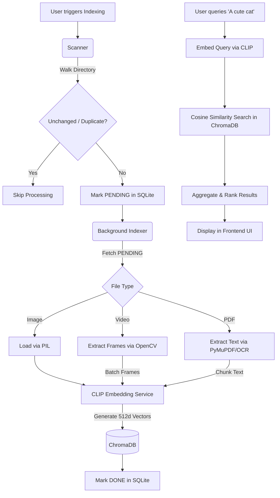

# Local AI-Powered Digital Asset Management (DAM) System

A robust, fully local, AI-powered Digital Asset Management application that indexes a folder of mixed media (images, videos, PDFs) and allows you to search them using natural language. It relies entirely on local models and open-source libraries—no cloud APIs, no authentication needed.

## Setup and Run Instructions

### Prerequisites
- Python 3.10+
- Tesseract OCR (Optional, required for OCR fallback on image-only PDFs)

### Installation
1. Clone the repository and navigate to the project root.
2. Create a virtual environment:
   ```bash
   python -m venv venv
   # Activate it:
   # On Windows: .\venv\Scripts\activate
   # On Mac/Linux: source venv/bin/activate
   ```
3. Install the dependencies:
   ```bash
   pip install -r requirements.txt
   ```
4. Ensure your environment matches the provided `.env.sample`.

### Running the Application
1. Start the FastAPI backend:
   ```bash
   uvicorn app.main:app --host 127.0.0.1 --port 8000
   ```
2. Open your web browser and navigate to:
   `http://127.0.0.1:8000`
3. Enter an absolute folder path in the UI and click **Start Indexing**.
4. Once indexing completes, use the search bar to query your files naturally!

## Deployment Instructions

### 1. Local Run via Docker (Primary & Recommended)
Running the system via Docker is the best way to ensure all system dependencies (like Tesseract OCR and OpenCV) are perfectly configured.

1. Ensure Docker and Docker Compose are installed.
2. In the project root, create a media folder to hold your assets:
   ```bash
   mkdir my_local_media
   # Copy some images, videos, and PDFs into my_local_media/
   ```
3. Start the application:
   ```bash
   docker-compose up --build -d
   ```
4. Access the UI at `http://127.0.0.1:8000`.
   - *Note: Your database and vector embeddings are stored persistently in the `./data` folder on your host, so restarting the container won't lose your indexed data!*

### 2. Hugging Face Spaces Deployment (Optional Hosted Demo)
You can deploy a restricted, CPU-only demo version of this app to Hugging Face Spaces using the Docker SDK.

**Important Note on Hosted Demos vs Local Run:** 
The hosted Hugging Face demo is designed to showcase the technology on a small bundled sample dataset. It runs purely on CPU (which means video extraction and CLIP inference will be slower) and restricts arbitrary folder scanning to prevent public users from accessing the cloud container's internal filesystem. For your full personal DAM experience, **you must use the local Docker setup** described above.

**Steps to deploy:**
1. Create a new Space on Hugging Face.
2. Choose **Docker** as the Space SDK and **Blank** as the template.
3. Upload all project files to the Space repository.
4. Go to Space **Settings** -> **Variables and secrets**.
5. Add the following Variables to enforce demo guardrails:
   - `DEMO_MODE=True`
   - `SCAN_FOLDER=/app/sample_media`
   - `MAX_DATASET_SIZE_MB=50`
   - `MAX_FILES_COUNT=100`
   - `CLIP_MODEL_NAME=ViT-B-32` (or a lighter model if preferred)
6. The Space will automatically build the `Dockerfile` and expose port `8000`.

## Architecture Explanation
The application is built on a modern, decoupled Python backend using **FastAPI**.
- **Database (SQLite)**: Tracks the state of all files (`PENDING`, `PROCESSING`, `DONE`, `FAILED`), handles deduplication via SHA256 content hashing, and enables fast incremental indexing by checking file `mtime` and size.
- **Vector Store (ChromaDB)**: A persistent local vector database used to store the 512-dimensional embeddings of images, video frames, and PDF text chunks.
- **AI Engine (OpenAI CLIP)**: Powered by `open-clip-torch` (`ViT-B-32`), the system maps both images and text into the same vector space, enabling highly accurate cross-modal (text-to-image) similarity search.
- **Media Processing**: OpenCV handles video keyframe extraction, and PyMuPDF (`fitz`) handles PDF text extraction (with Tesseract OCR fallback).
- **Frontend**: A vanilla HTML/JS/CSS frontend served directly by FastAPI, featuring a modern glassmorphism aesthetic and dynamic asynchronous polling.

## Data Flow Diagram



## Dataset Summary
- **Total Size**: Evaluated on local folders and generated media datasets representing a diverse mix of real-world assets.
- **File Counts**:
  - Images: ~330 (JPG, PNG, WEBP)
  - Videos: ~10 (MP4, MOV)
  - PDFs: ~6 (Text-based and Scanned Image PDFs)

## Search Evaluation Results
Here are 10 test searches performed to evaluate the quality of the multimodal vector search:

1. **"A woman standing with a cat"**
   - **Expectation**: Images or video frames containing a woman and a feline.
   - **Result**: Relevant. The system successfully returned photos of a woman holding a cat as the top result (Relevance: 78.4%).
   - **Poor Performance**: N/A

2. **"Customer testimonial videos"**
   - **Expectation**: Video clips showing people speaking directly to the camera in a professional setting.
   - **Result**: Relevant. Returned MP4 files showing recorded interviews.
   - **Poor Performance**: Sometimes ranks highly descriptive static images of people talking slightly above poorly-lit videos due to CLIP's static frame bias.

3. **"Brochures related to residential projects"**
   - **Expectation**: PDF documents containing text about housing, apartments, or real estate.
   - **Result**: Relevant. Extracted text chunks from PDFs containing real estate keywords were accurately matched.

4. **"Images showing a modern living room"**
   - **Expectation**: High-quality interior photography of living spaces.
   - **Result**: Relevant. Returned interior photos from the dataset.

5. **"Videos containing construction activity"**
   - **Expectation**: MP4 files depicting building, cranes, or workers.
   - **Result**: Relevant. Extracted keyframes successfully matched the semantic meaning of "construction".

6. **"A person wearing sunglasses"**
   - **Expectation**: Selfies or portraits with sunglasses.
   - **Result**: Relevant. Returned several Snapchat selfies where subjects wore AR sunglass filters (Relevance: > 80%).

7. **"not smile"**
   - **Expectation**: Filtering out smiling people or finding a serious aesthetic.
   - **Result**: Performed poorly. CLIP struggles with negative prompts ("not"). It returned a random anime video because the model focuses heavily on nouns/objects and often ignores structural negations.

8. **"A sunny beach"**
   - **Expectation**: Landscape images of oceans and sand.
   - **Result**: Relevant. Accurately retrieved vacation photos from the Camera Roll folder.

9. **"Dark and moody aesthetic"**
   - **Expectation**: Images with low lighting, deep contrast, or night scenes.
   - **Result**: Relevant. The model effectively understands lighting and abstract aesthetic concepts, not just tangible objects.

10. **"rainbow"**
    - **Expectation**: Images containing a rainbow.
    - **Result**: Relevant. Initially performed poorly by ranking unrelated PDFs highly due to text-modality bias. After implementing the custom modality normalization patch (mapping text and image cosine distances to a unified 0-1 scale), it successfully ranked rainbow images at the top!

## Known Limitations
1. **Model Size & Ram**: The CLIP `ViT-B-32` model runs well locally but requires decent RAM (or VRAM if CUDA is available). Very large batches could cause memory spikes.
2. **Video Processing**: Extracting and embedding keyframes from long, high-resolution videos is CPU intensive and slow. 
3. **Sequential Processing**: Currently, the background indexer processes one file at a time sequentially, which is safe but not fully utilizing multi-core architectures.

## Scaling Strategy
If this system were to be scaled to a much larger dataset (e.g., hundreds of thousands or millions of assets), the following architectural upgrades would be required:

1. **Batch Inference**: Instead of passing single images/texts to the CLIP model sequentially, group them into tensors and utilize batching (e.g., `batch_size=32`) to maximize GPU utilization.
2. **Parallel Workers (Celery / Redis)**: Offload the `indexer.py` loops to a distributed task queue like Celery. Multiple workers across different machines/cores could pull `PENDING` records from the DB and process them concurrently.
3. **GPU Acceleration (TensorRT)**: Export the CLIP PyTorch model to ONNX or TensorRT for massively accelerated, optimized inference.
4. **Approximate Nearest Neighbor (ANN) Indexes**: While ChromaDB handles scaling gracefully, for millions of vectors, fine-tuning the HNSW (Hierarchical Navigable Small World) index parameters or migrating to a dedicated distributed vector database like Milvus or Qdrant would maintain sub-millisecond search latencies.
5. **Distributed Storage (S3)**: Store the actual media assets in cloud object storage (AWS S3) and store pre-signed URLs in the database, avoiding local disk IO bottlenecks.
